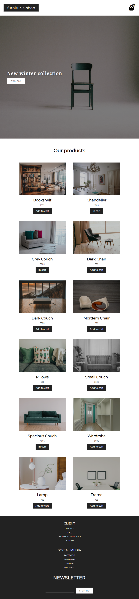

# furnitur-e-shop

[live](https://app.netlify.com/sites/optimistic-easley-4c7dd7/overview)

## Views:
### home page:

### home page (mobile devices):

### details:

### cart:

## Functionality:
### navbar:
-logo carries user to home page
-shopping bag icon carries user to cart
-shopping bag icon has counter with current amount of items located in cart
### home page: 
-'explore' button carries user to products list
-product image carries user to details page
-after clicking 'Add to cart' button, product will be added to cart, and button will change its text to 'In cart'
### details page
-'Back to cart' button will take user to home page
-'Add to cart'/'In cart' button
### cart:
-cart shows products that have been added to cart
-user can increase and decrease amount of products
-total value 
-paypal sandbox
-if there are no products in cart, user will see "YOUR CART IS EMPTY" instead
### others:
-if user passes wrong path, component NotFound will be shown
-local storage,
